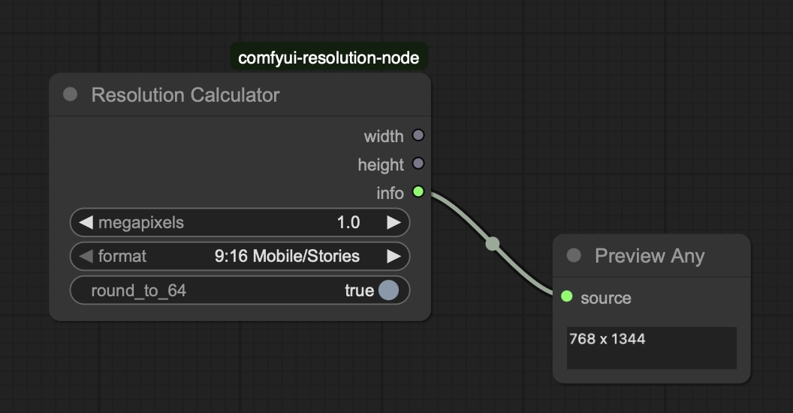

# ComfyUI Resolution Calculator Node

A custom node for ComfyUI that calculates optimal image dimensions based on megapixels and aspect ratio requirements.

## Features

- **Megapixel Input**: Specify target resolution in megapixels (0.1 - 100.0 MP)
- **Professional Formats**: Choose from 12 classic and professional aspect ratios
- **Smart Rounding**: Optional rounding to nearest multiple of 64 (AI-friendly)
- **Resolution Info**: Displays computed resolution as readable string output
- **Precise Calculations**: Maintains exact aspect ratios while hitting target megapixel count
- **Helpful Tooltips**: All inputs include explanatory tooltips

## Supported Format Options

**Portrait Formats:**
- 9:16 Mobile/Stories (0.56 ratio)
- 2:3 Photography Portrait (0.67 ratio)  
- 3:4 Classic Portrait (0.75 ratio)
- 4:5 Print Standard Portrait (0.8 ratio)
- 6:7 Medium Format Portrait (0.86 ratio)

**Square Format:**
- 1:1 Square (1.0 ratio)

**Landscape Formats:**
- 7:6 Medium Format Landscape (1.17 ratio)
- 5:4 Print Standard Landscape (1.25 ratio)
- 4:3 Classic Landscape (1.33 ratio)
- 3:2 Photography Landscape (1.5 ratio)
- 16:9 Widescreen (1.78 ratio)
- 21:9 Cinematic (2.33 ratio)

## Installation

1. Clone or download this repository into your ComfyUI custom nodes directory:
   ```bash
   cd ComfyUI/custom_nodes/
   git clone https://github.com/skempken/comfyui-resolution-node.git comfyui-resolution-node
   ```

2. Restart ComfyUI

3. The "Resolution Calculator" node will appear in the `image/resolution` category

## Screenshot



The screenshot shows the Resolution Calculator node configured for mobile content (1.0 MP, 9:16 Mobile/Stories format) with the computed resolution displayed in a Preview Any node.

## Usage

1. Add the "Resolution Calculator" node to your workflow
2. Set your desired **megapixels** (e.g., 1.0 for ~1 million pixels)
3. Choose a **format** from the dropdown (includes both portrait and landscape variants)
4. Toggle **round_to_64** if you need AI-compatible dimensions
5. Connect the width/height outputs to your image generation nodes
6. Use the **info** output to see the computed resolution string

## Node Inputs

- **megapixels** (float): Target resolution in megapixels (0.1 - 100.0)
- **format** (dropdown): Image aspect ratio format (includes portrait and landscape variants)
- **round_to_64** (boolean): Round dimensions to nearest multiple of 64

## Node Outputs

- **width** (int): Calculated image width in pixels
- **height** (int): Calculated image height in pixels  
- **info** (string): Human-readable resolution display (e.g., "1344 x 768")

## Examples

| Input | Output | Actual MP |
|-------|--------|-----------|
| 1.0 MP, 16:9 Widescreen, rounded | 1344×768 | 1.03 MP |
| 1.0 MP, 9:16 Mobile/Stories, rounded | 768×1344 | 1.03 MP |
| 2.0 MP, 4:3 Classic Landscape, not rounded | 1633×1225 | 2.00 MP |
| 0.5 MP, 1:1 Square, rounded | 704×704 | 0.50 MP |
| 1.5 MP, 3:2 Photography Landscape, rounded | 1472×960 | 1.41 MP |

## Why Round to 64?

Many AI image generation models work optimally with dimensions that are multiples of 64. This ensures:
- Better model performance
- Reduced artifacts
- Consistent results across different resolutions

## Development

This project is set up for PyCharm development with included `.idea` configuration files.

## License

MIT License - see LICENSE file for details.